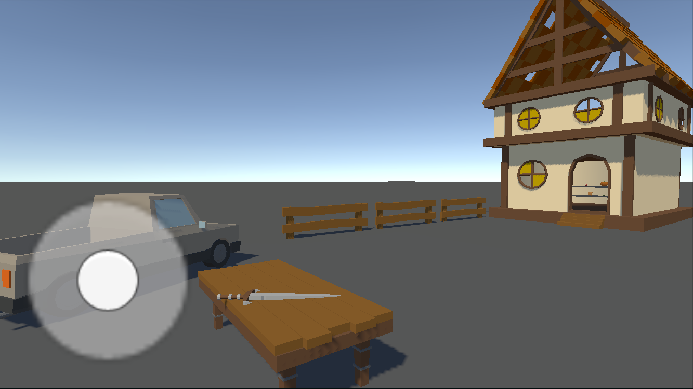
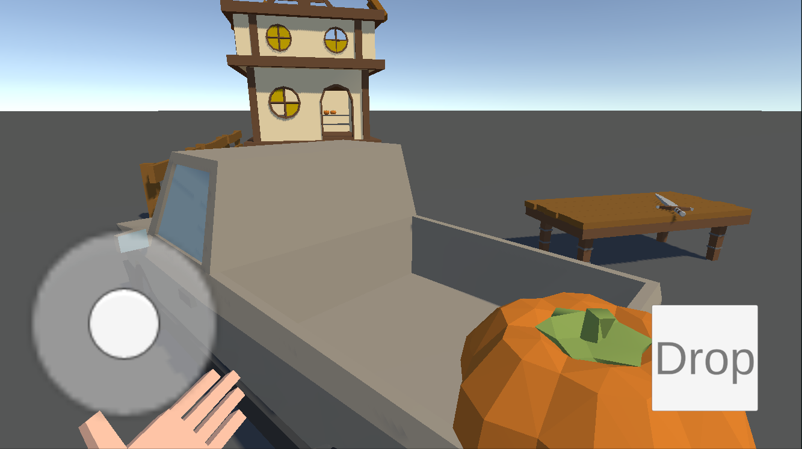

# First-Person Mobile Shopping Simulator

  
  
  

## 📱 Описание проекта
Тестовое задание для студии разработки игр. Реализован мобильный симулятор магазина с управлением от первого лица.

### ✅ Выполненные требования:
- **Мобильное управление**:
    - Джойстик для передвижения (джойстик слева)
    - Касание и перемещение пальца для осмотра (свободная часть экрана)
- **Взаимодействие с предметами**:
    - Подбор фруктов кликом по ним
    - Визуальное отображение предмета в руках
    - Физическое взаимодействие отключается при удержании
    - Кнопка "Выбросить" (появляется справа)
    - Выброс предмета с импульсом вперед
- **Сцена**:
    - Магазин с прилавком и полками
    - Фрукты (яблоки, апельсины)
    - Грузовик для доставки
- **Технологии**:
    - **Zenject** для DI
    - **New Input System** для управления
    - **Character Controller** для передвижения

## 🎮 Управление
- **Левая часть экрана**: виртуальный джойстик (передвижение)
- **Правая часть экрана**: касание + движение пальца (вращение камеры)
- **Тап по предмету**: взять в руки
- **Кнопка "DROP"**: выбросить предмет с импульсом.

